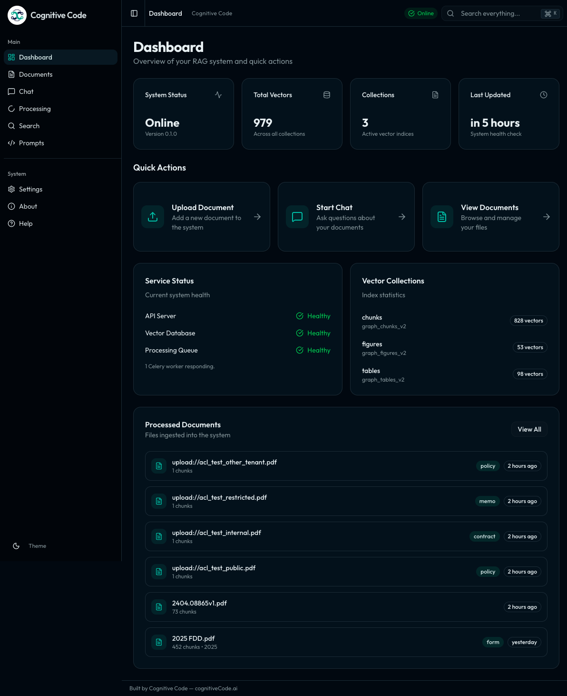

<div align="center">


# NPR — Near-Perfect RAG

**Auditable document question answering with evidence-first retrieval, explicit citations, and reproducible traces.**

Built by [Larry Stewart](https://github.com/LarryStewart2022) at [Cognitive Code](https://cognitivecode.ai).

<p>
  <a href="https://github.com/CognitiveCodeAI/rag-main-2/actions/workflows/ci.yml"></a>
  <a href="LICENSE"></a>
  
  
  
</p>

<p>
  <a href="#quick-start">Quick start</a> ·
  <a href="#architecture">Architecture</a> ·
  <a href="#testing">Testing</a> ·
  <a href="#documentation">Documentation</a> ·
  <a href="CONTRIBUTING.md">Contributing</a> ·
  <a href="https://github.com/CognitiveCodeAI/rag-main-2/discussions">Discussions</a>
</p>

</div>

> [!IMPORTANT]
> **Project status: controlled pilot.** NPR has strong automated test and provenance foundations, but it is not represented as broadly production-ready for legal, clinical, or other high-stakes use. Production promotion requires deployment-specific security review, ACL enablement, representative domain validation, and operational load testing.

<p align="center">
  
</p>

## Why NPR

NPR (Near-Perfect RAG) is a full-stack RAG system that retrieves relevant document evidence and generates answers with explicit citations. The system prioritizes:

- **Evidence-first answers**: Every claim is grounded in retrieved document evidence
- **Citation completeness**: All factual claims include source citations with page numbers
- **Explicit abstention**: When insufficient evidence exists, the system asks clarifying questions or abstains rather than guessing
- **Reproducibility**: Every response produces a replayable trace for debugging and auditing

## Architecture

```
                                    NPR RAG System
    ┌─────────────────────────────────────────────────────────────────────┐
    │                           ONLINE PLANE                               │
    │  ┌──────────┐    ┌──────────┐    ┌──────────┐    ┌──────────────┐  │
    │  │  Query   │───▶│ Planner  │───▶│ Retrieve │───▶│   Generate   │  │
    │  │ Gateway  │    │          │    │ & Rerank │    │ (with cites) │  │
    │  └──────────┘    └──────────┘    └──────────┘    └──────────────┘  │
    └─────────────────────────────────────────────────────────────────────┘
                                        │
                    ┌───────────────────┼───────────────────┐
                    ▼                   ▼                   ▼
              ┌──────────┐       ┌──────────┐       ┌──────────┐
              │PostgreSQL│       │  Milvus  │       │  MinIO   │
              │ (Graph)  │       │ (Vectors)│       │ (Storage)│
              └──────────┘       └──────────┘       └──────────┘
    ┌─────────────────────────────────────────────────────────────────────┐
    │                          OFFLINE PLANE                               │
    │  ┌──────────┐    ┌──────────┐    ┌──────────┐    ┌──────────────┐  │
    │  │  Ingest  │───▶│  Parse   │───▶│  Chunk   │───▶│    Embed     │  │
    │  │ Document │    │ & Layout │    │ & Index  │    │  (OpenAI)    │  │
    │  └──────────┘    └──────────┘    └──────────┘    └──────────────┘  │
    └─────────────────────────────────────────────────────────────────────┘
```

## Tech Stack

| Component | Technology |
|-----------|------------|
| Backend API | FastAPI on Python 3.12 |
| Frontend | Next.js 16 + React 19 |
| Vector Database | Milvus |
| Relational DB | PostgreSQL |
| Object Storage | MinIO (S3-compatible) |
| Task Queue | Celery + Redis |
| Embeddings | OpenAI text-embedding-3-large |
| LLM (Chat) | OpenAI-backed grounded answer generation |

## Quick Start

```bash
git clone https://github.com/CognitiveCodeAI/rag-main-2.git
cd rag-main-2
./dev init
./dev up
```

`./dev init` validates prerequisites (Docker, Python 3.12, Node 20.9+, and npm) and creates or synchronizes `backend/.env` from `backend/.env.example` without overwriting existing values.

`./dev up` runs first-time bootstrap when needed, starts local infrastructure, then starts backend, frontend, and celery.

Open:
- Frontend: http://localhost:3000
- Backend API: http://localhost:8000
- API docs: http://localhost:8000/docs

Useful commands:
- `./dev status`
- `./dev logs app` or `./dev logs infra`
- `./dev monitor` (foreground) or `./dev monitor --daemon` (background)
- `./dev doctor`
- `./dev migrate`
- `./dev seed`
- `./dev test`
- `./dev reset --yes` (or `./dev reset --volumes --yes` to wipe service data)
- `./dev down`

> Need deep setup/troubleshooting details? See [SETUP.md](SETUP.md).

### Troubleshooting

- If `./dev up` fails: run `./dev doctor`, then `./dev logs infra`.
- If API/UI is unreachable: run `./dev status`, then `./dev logs app`.
- If migrations fail: run `./dev migrate` and review backend output.
- If startup state is corrupted: run `./dev reset --yes` (or `./dev reset --volumes --yes` to wipe data), then `./dev init` and `./dev up`.

### Optional Active Monitor

The active monitor is opt-in and safe-by-default:
- Off by default (`MONITOR_ENABLED=false`)
- Observe-only unless `MONITOR_MODE=heal`
- Supports dry-run (`MONITOR_DRY_RUN=true`) and circuit breaker safeguards

Run it via `./dev`:

```bash
# Foreground monitor (Ctrl+C to stop)
MONITOR_ENABLED=true MONITOR_MODE=observe ./dev monitor

# Background daemon monitor
MONITOR_ENABLED=true MONITOR_MODE=heal ./dev monitor --daemon

# Inspect monitor status/logs
./dev monitor --status
./dev monitor --stop
./dev logs monitor
./dev status
```

Monitor environment variables:
- `MONITOR_ENABLED` = `true|false`
- `MONITOR_MODE` = `observe|heal`
- `MONITOR_DRY_RUN` = `true|false`
- `MONITOR_INTERVAL_SECONDS`
- `MONITOR_MAX_RETRIES`
- `MONITOR_BACKOFF_SECONDS`
- `MONITOR_CIRCUIT_BREAKER_THRESHOLD`

Monitor outputs:
- Structured incident log: `logs/monitor.jsonl`
- State/dedupe file: `.monitor_state.json`

## API Endpoints

Once running, access:

- **API Docs**: http://localhost:8000/docs (Swagger UI)
- **Health Check**: http://localhost:8000/health
- **Frontend**: http://localhost:3000

### Key Endpoints

| Endpoint | Method | Description |
|----------|--------|-------------|
| `/v1/ingest/document` | POST | Upload and process documents |
| `/v1/qa/ask` | POST | Ask questions about documents |
| `/v1/retrieve/vector` | POST | Vector search for relevant chunks |
| `/api/query` | POST | Query endpoint (legacy) |
| `/health` | GET | System health status |

## Project Structure

```
rag/
├── backend/
│   ├── app/
│   │   ├── db/          # Database models & sessions
│   │   ├── graph/       # Document graph processing
│   │   ├── llm/         # LLM clients (OpenAI)
│   │   ├── qa/          # Question answering pipeline
│   │   ├── routes/      # FastAPI routes
│   │   ├── tasks/       # Celery background tasks
│   │   └── vectordb/    # Milvus vector operations
│   ├── scripts/         # Setup and utility scripts
│   ├── tests/           # Test suite
│   └── docs/            # Documentation
├── frontend/            # Next.js frontend
├── contracts/           # JSON schema contracts
├── docker-compose.yml   # Infrastructure setup
└── lighthouse.md        # System specification
```

## Documentation

- [Setup Guide](SETUP.md) - **Complete setup instructions with troubleshooting**
- [Quick Start Guide](backend/docs/QUICK_START.md) - Condensed setup steps
- [Deployment Guide](backend/docs/DEPLOYMENT_GUIDE.md) - Production deployment
- [System Specification](lighthouse.md) - Full architecture spec
- [Prompting Guide](PROMPTING_GUIDE.md) - Prompt engineering practices
- [Security Policy](SECURITY.md) - Private vulnerability reporting and scope
- [Support](SUPPORT.md) - Questions, issues, and commercial support
- [Maintainer Guide](MAINTAINING.md) - Review, triage, and repository stewardship
- [Release Guide](RELEASING.md) - Versioning and release procedure

## Configuration

See [backend/.env.example](backend/.env.example) for all configuration options.

Key settings:

| Variable | Required | Description |
|----------|----------|-------------|
| `OPENAI_API_KEY` | Yes | OpenAI API key for embeddings |
| `DB_PASSWORD` | Yes | PostgreSQL password |
| `MINIO_SECRET_KEY` | Yes | MinIO secret key |
| `DEBUG` | No | Enable debug mode (default: false) |

## Testing

```bash
# Preferred repository-wide test entry point
./dev test

# Backend directly
cd backend
venv/bin/python -m pytest -q

# Frontend directly
cd ../frontend
npm test
npm run lint
npx tsc --noEmit
npm run build
```

## Development

### Adding a New Document Type

1. Add parser in `backend/app/graph/`
2. Update chunking logic in `backend/app/graph/chunker.py`
3. Add tests in `backend/tests/`

### Running Evaluations

```bash
cd backend
python tests/eval/run_qa_eval.py --contract tests/eval/benchmark_contract.json
```

Benchmark runs are contract-gated. If dataset hashes, mode settings, or benchmark-critical flags drift from
`backend/tests/eval/benchmark_contract.json`, the run exits before execution.

To refresh benchmark contract hashes/counts after intentional benchmark file changes:

```bash
cd backend
python tests/eval/update_benchmark_contract.py
```

## Contributing

Contributions are welcome. Read [CONTRIBUTING.md](CONTRIBUTING.md), follow the [Code of Conduct](CODE_OF_CONDUCT.md), and use the repository's issue and pull-request templates. Questions belong in [GitHub Discussions](https://github.com/CognitiveCodeAI/rag-main-2/discussions); vulnerabilities belong in a [private security advisory](https://github.com/CognitiveCodeAI/rag-main-2/security/advisories/new).

## License

NPR is available under the [MIT License](LICENSE).

---

<div align="center">
  <sub>Built by <a href="https://cognitivecode.ai">Cognitive Code</a> · <a href="SUPPORT.md">Support</a> · <a href="SECURITY.md">Security</a> · <a href="RELEASING.md">Releases</a></sub>
</div>
